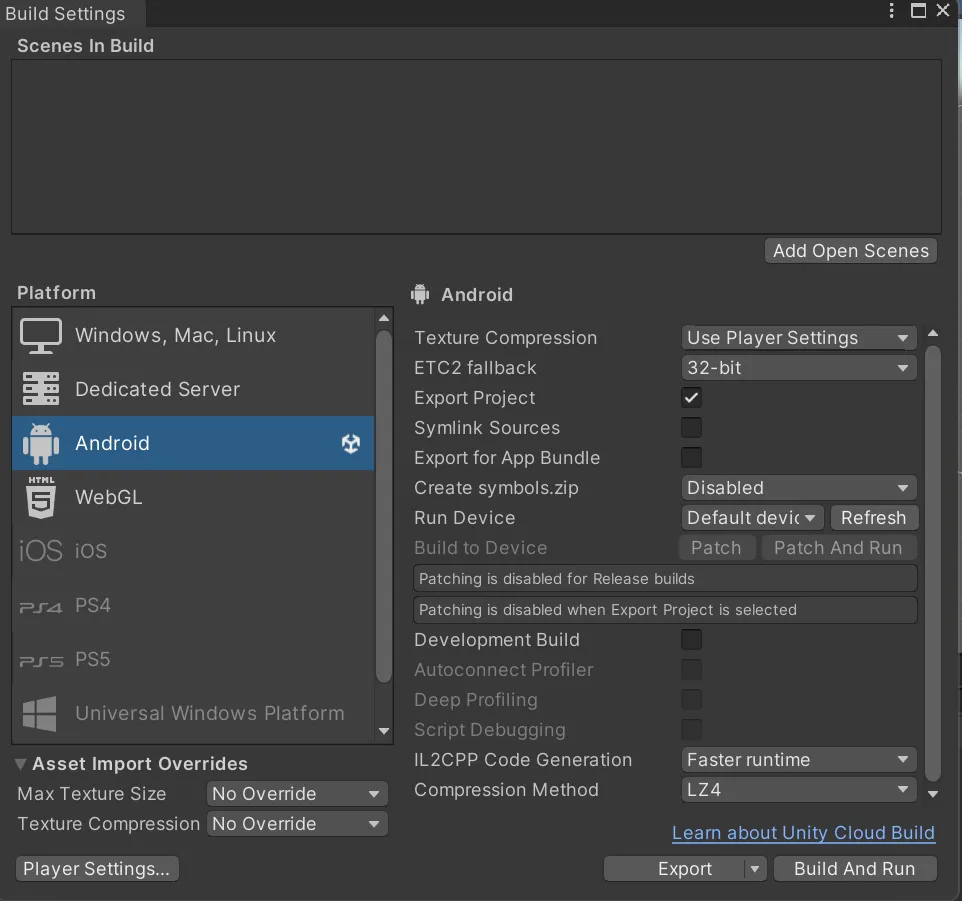
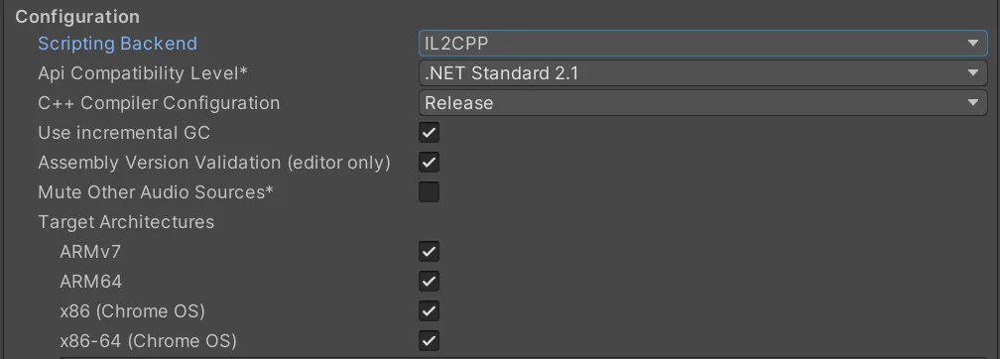
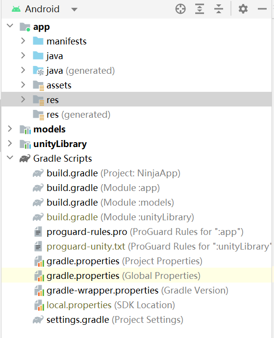

# Ninja
Ninja game for VE441


## Getting Started

Some third-party libraries we'll use:

- Front-end:

    - Unity3D

    - mediapipe

    - vosk

- Back-end:

    - Django
    - Websocket

        

## Story Map


Ninja will capture both players' voices and gestures, using the microphones and camera on smart devices. The captured Audio/Video frames will be sent to the back-end server implemented by Django. The backend server will then run Deep Neural Network to make inference on the transmitted Audio/Video frames. The results of the inferences will be sent back to the game content in order to make updates.


## APIs and Controller
```
- GameStart(username0:String, username1:String, player_id:Int(0,1), room_id:Int)
- AddGestureBuffer(username:String, gesture:String) gesture:Thumb_Up, ILoveYou
- ClearGestureBuffer(username:String)
- ReleaseSkill(username:String, skill:String) skill "LIGHT_SHIELD" "LIGHT_ATTACK"
- DefendSuccess(username:String, skill:String)
- ChangeHP(username:String, value: Int)
- GameOver(winner:String,loser:String)
- InvokeMenu(username:String)
```


## View UI/UX

The UI/UX page of our product is shown in the following figure:


Our app has three systems: The login system, the room system, and the game system. For the login system,  users should log in for the game to play, then users can choose to join or start a room. After the room is created and joined by two users, the game starts for the battleground. After one user win the game, the game ends.

The result of the Mockup Usability Test result is shown in the following table:

|             Tasks              | Evaluation Metrics | Blue App(% success) |
| :----------------------------: | :----------------: | :-----------------: |
| Login Game Menu and chose mode |    <= 2 clicks     |        100%         |
|   Waiting for the game start   |     <=3 clicks     |         40%         |
|    Chose skills for battle     |    <= 4 clicks     |        100%         |
|     Update game settlement     |    <= 2 clicks     |         80%         |
|      Log out to homepage       |     <= 1 click     |        100%         |


## Team Roster:

- Lai Ruiqi: Full-stack development
- Zhang Lechen: Unity development
- Yi Shanglin: Frontend development
- Li Zekai: Gesture recognition development, thesis writing
- Chen Yifan: Speech recognition development, thesis writing
- Chen Xuzhong: Gesture recognition development, thesis writing

## Team Roster

- Lai Ruiqi: 

    **Unity geometric battleground**: I implement the websocket server for battle field

    **Online Room System**: I implement the websocket server for the room system, inlcuding the create,join and quit functions of the room

    **Online Battle System**: I implement the websocket server for battle system, including enable the players to release skills to fight with each other.

    **Real-time feedback**: I implement the websocket server so two players can exchange information and game status through the server.

    **Access phone camera**: I use android native library to access the camera and transfer frames to gesture recognizer.

    **Recognize basic gesture**: I use mediapipe library to recognize gesture and tranfer them to backend server.
    
- Zhang Lechen: 

    **Unity geometric battleground**: I implemented all basic 3D geometric contents and game logics in Unity

    **Anime player characters**: I implemented all animations and functions in Unity, including character's animation (idle, attack, defend), player's buffer system, and the weapons (shuriken and fireball).

    **Online Basic System**: I implemented the attack system with gesture buffer and corresponding skill combinations.

    **Recognize basic gesture**: I helped investigate mediapipe library and explore its usage.

    **Real-time feedback**: I implemented the real-time interaction API in Unity and basic Unity game logic.

- Yi Shanglin:

    **Main Page Login System**: implemented a system that allows the user to sign in and log in.

    **Main Page Room System**: implemented a system that allows the user to prompt for creating or joining a room.

    **Main Page UI**: implemented a pixel-art styled main page with background, game logo and buttons.

    **Background Music**: added background music to both the main page and game scene.
    
- Li Zekai:

    **Recognize basic gestures**: I use the python-mediapipe library to recognize basic gestures and recognize hands landmarks.

    **Customized gesture recognition**: I will use the mediapipe library in Kotlin to recognize hands landmarks for inference.

    **Customized gesture recognition**: I will use hands landmarks to develop further customized gesture recognition for diverse control signals.
    
- Chen Yifan:

    **Access phone microphone**: Use the native Android library to request microphone permissions and capture player's voice
    
    **Recognize speech**: Utilize the Vosk offline library for efficient speech recognition

- Chen Xuzhong:

    **Recognize basic gestures:** Implemented with mediapipe library to recognize the basic gestures, to be more specific, use the recognizeImage function.

    **Streaming-based inference**: I use mediapipe API to make sure that as the game is going on, the video stream is on and the game keeps recognizing gestures made by users.

    **Access Phone camera:** Make sure that our app gets permission to access the camera of the users all the time in order to make sure our streaming-based inference works well as the game is going on.

## Challenges we encountered:
The first challenge we encountered is gesture recognition in Android. We initialy wanted to push the video to server to perform the gesture recognition but then realized it requires large network bandwidth, so the recognition task should be preformed in frontend, namely, on android devices. We managed to solve this problem by using a third-party framework named mediapipe, which has a complete structure for offline gesture recognition.

The second challenge we encountered is backend-frontend interaction, our project is a mobile game that requires low delay in terms of game status update, so using the traditional HTTP server-client mode cannot satisfy our needs: the client have to poll the server to query whether a new updates has been sent. We managed to solve this problem by implementing a websocket server, which is a different network protocol to HTTP, which enables the server to **push** messages to the client, in this way, the client can receive the game status updates once the updates has been generated in the backend, which greatly reduces the delay.

The third challenge we encountered is the speech recognition. We've found out that Android's native speech recognizer cannot be adopted to the special version of Android on Chinese phones, including HUAWEI and XIAOMI, because they do not have GMS installed. So we can only turn to third-party speech recognition library for help. We've tried Tecent and Xunfei's speech recoginition SDK, but they turned out to be not accurate and fast enought to satisfy our needs, luckily we finally discovered a third-party speech revoginition named **vosk**, which is both easy to use and accurate enough for our task.
    

## Getting Started
Our project use android and Unity as front-end, django and websocket as backend. Following are the instructions on how to setup these server.
You can simply use pre-built apk in latest release, or build from source, following are the guides for building from source.
### Backend
Backend codes are stored in [Ninja-backend](https://github.com/lrq619/Ninja-backend), which consists of a http server and a websocket server.
To clone it:
```
git clone https://github.com/lrq619/Ninja-backend.git
```
Before setting up our game server, you should first install nginx and django by:
```
sudo apt install python3-pip python3-dev python3-venv libpq-dev postgresql postgresql-contrib nginx curl
```
#### I. Http Server
Http server is used for user login system, it adapts django framework.
```
cd Ninja-backend/
source env/bin/activate
```
Now the python virtual environment should be activated, and in your terminal you should see (env) in front of your command line.
```
sudo cp systemd/gunicorn-ninja.socket /etc/systemd/system/
```
Find systemd/gunicorn-ninja.service file, replace the {PATH_TO_NINJA} to the path to Ninja-backend folder.
and then:
```
sudo cp systemd/gunicorn-ninja.service /etc/systemd/system/
```
Now you can start the gunicorn service by:
```
sudo systemctl start gunicorn-ninja.socket
sudo systemctl enable gunicorn-ninja.service
```
The gunicorn socket is now online, next step is to configure nginx configuration.
We should create a config file for our game:
```
sudo vim /etc/nginx/sites-available/ninja
```
Below is the file content:
```
server {
  listen 443 ssl;
  listen [::]:443 ssl;

  ssl_certificate     /etc/ssl/certs/{YOUR_CERT};
  ssl_certificate_key /etc/ssl/private/{YOUR_KEY};
  ssl_protocols TLSv1.2;
  ssl_ciphers {YOUR_SSL_CIPHER};

  server_name {SERVER_NAME};

  location = /favicon.ico { access_log off; log_not_found off; }
  location /static/ {
    root {PATH_TO_NINJA}/Ninja-backend/;
  }

  location / {
    include proxy_params;
    proxy_pass http://unix:/run/gunicorn-ninja.sock;
  }

  client_max_body_size 10M;
}
server {
  listen 80;
  listen [::]:80;
  server_name {SERVER_NAME};
  
  return 301 https://$server_name$request_uri;
}
```
Remeber to replace contents in the bracket.
Then:
```
sudo ln -s /etc/nginx/sites-available/chatter /etc/nginx/sites-enabled
```
Now we're ready to go:
```
sudo systemctl restart nginx
```
Make sure your firewall is open on 80 and 443 port.

#### II. Websocket Server
Setting up the websocket server is easy.
First, replace the WorkingDirectory and ExecStart's path to your own path.
```
sudo cp systemd/ninja-ws.service /etc/systemd/system/
```
Then:
```
sudo systemctl start ninja-ws
```

### Frontend
clone the front end project(this repo)
Our game integrates Unity with Android and it takes a lot of effort to make these two components work.
For Unity, we use the version:2021.3.24, the download link is here: [Unity 3.24](https://unity.com/releases/editor/whats-new/2021.3.24)

For android studio, we use: Android Studio Flamingo | 2022.2.1 Patch 1, build version: Build #AI-222.4459.24.2221.9971841.
#### I. Unity
After download the corresponding version of Unity, Open the project in Ninja/NinjaUnity/


In File > Build Settings, choose `Android` in Platform, and in Player Settings > Other Settings > Configuration, make sure the configuration is as following figure

Then, close Player Settings, choose Export, export the Unity project to Ninja/NinjaUnity/androidBuild
If the folder doesn't exist, then create it.

#### II. Android 
After exporting the Unity project, open Android Studio Ninja/AndroidApp , you should see the project structure like this:


Then, check the gradle file build.gradle(Module :unityLibrary) to see if there is such a line:
```
android {
    ...
    ndkVersion = "21.3.6528147"
    ...
}
```
If not, add this line to android {} in build.gradle(Module :unityLibrary).

Then, we should install the NDK for building the project.
In Android Studio, Tools > SDK Manager > SDK Tools, check the `Show Package Details` in the right bottom corner, and find NDK (Side by side) > 21.3.6528147, check it, and click `Apply`, the NDK will be downloaded.

Now everything is done, sync the graddle files and you can build the whole project, note that we only test this game on Android with API level 31, API levels lower than this may cause problem.
