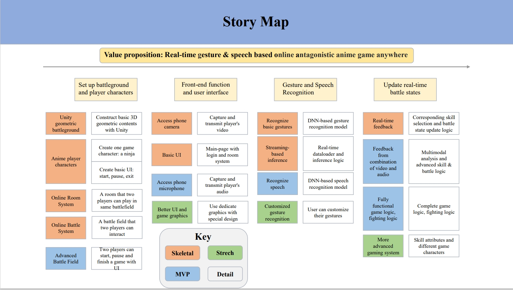
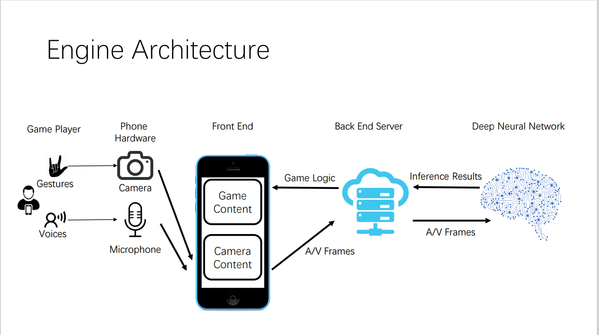
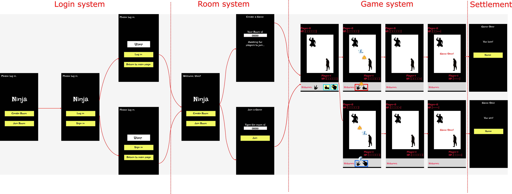

# Ninja
Ninja game for VE441


## Getting Started

Some third-party libraries we'll use:

- Front-end:

    - Unity3D

    * mediapipe

- Back-end:

    - Django

        

## Story Map


Ninja will capture both players' voices and gestures, using the microphones and camera on smart devices. The captured Audio/Video frames will be sent to the back-end server implemented by Django. The backend server will then run Deep Neural Network to make inference on the transmitted Audio/Video frames. The results of the inferences will be sent back to the game content in order to make updates.


## APIs and Controller
```
fun TransmitAudioFrame(AudioFrame* aFrames, BackendServer* server); // API used to transmit the audio frames to the backend server

fun TransmitVideoFrame(VideoFrame* vFrames, BackendServer* server); // API used to transmit the video frames to the backedn server

fun GetUpdatesFromServer(Updates* updates, BackendServer* server); // API used to accept update from backend server

fun applyUpdates(Updates* updates, View* view); // API used to apply updates to the game views
```


## View UI/UX

The UI/UX page of our product is shown in the following figure:



Our app has three systems: The login system, the room system, and the game system. For the login system,  users should log in for the game to play, then users can choose to join or start a room. After the room is created and joined by two users, the game starts for the battleground. After one user win the game, the game ends.

The result of the Mockup Usability Test result is shown in the following table:

|             Tasks              | Evaluation Metrics | Blue App(% success) |
| :----------------------------: | :----------------: | :-----------------: |
| Login Game Menu and chose mode |    <= 2 clicks     |        100%         |
|   Waiting for the game start   |     <=3 clicks     |         40%         |
|    Chose skills for battle     |    <= 4 clicks     |        100%         |
|     Update game settlement     |    <= 2 clicks     |         80%         |
|      Log out to homepage       |     <= 1 click     |        100%         |


## Team Roster:

- Lai Ruiqi: Full-stack development
- Zhang Lechen: Unity development
- Yi Shanglin: Frontend development
- Li Zekai: Gesture recognition development, thesis writing
- Chen Yifan: Speech recognition development, thesis writing
- Chen Xuzhong: Gesture recognition development, thesis writing

## Individual Contributions

- Lai Ruiqi: 

    **Unity geometric battleground**: I implement the websocket server for battle field

    **Online Room System**: I implement the websocket server for the room system, inlcuding the create,join and quit functions of the room

    **Online Battle System**: I implement the websocket server for battle system, including enable the players to release skills to fight with each other.

    **Real-time feedback**: I implement the websocket server so two players can exchange information and game status through the server.

    **Access phone camera**: I use android native library to access the camera and transfer frames to gesture recognizer.

    **Recognize basic gesture**: I use mediapipe library to recognize gesture and tranfer them to backend server.
- Zhang Lechen:
- Yi Shanglin:
- Li Zekai:
- Chen Yifan:
- Chen Xuzhong:
